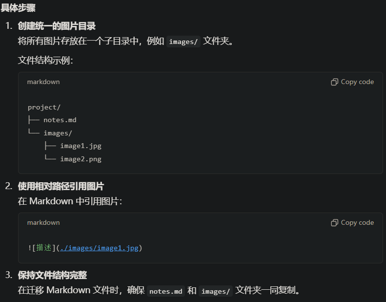

文件名不要有中文

# 构造函数 

```cpp
class Box

{

public:

  // Default constructor

  Box() {}

  // Initialize a Box with equal dimensions (i.e. a cube)

  // 使用 explicit 关键字修饰构造函数，表示该构造函数不能用于隐式类型转换。

  // 也就是说，编译器不会自动将一个 int 类型的值隐式转换为 Box 类型的对象。

  // 这是一个带有单个 int 参数的构造函数

  // 成员初始化列表用于在构造函数体执行之前初始化类的成员变量。

  explicit Box(int i) : m_width(i), m_length(i), m_height(i) // member init list

  {

  }

  // Initialize a Box with custom dimensions

  Box(int width, int length, int height): m_width(width), m_length(length), m_height(height)

  {

  }

  int Volume() { return m_width * m_length * m_height; }

private:

  // Will have value of 0 when default constructor is called.

  // If we didn't zero-init here, default constructor would

  // leave them uninitialized with garbage values.

  int m_width{0};

  int m_length{0};

  int m_height{0};

};

int main()

{

  Box b; // Calls Box()

  // Using uniform initialization (preferred):

  Box b2{5};     // Calls Box(int)

  Box b3{5, 8, 12}; // Calls Box(int, int, int)

  // Using function-style notation:

  // 初始化的时候使用的是（）而不是{}，但{}更规范

  Box b4(2, 4, 6); // Calls Box(int, int, int)

}
```

## explicit关键字的作用：

没有explicit的时候，也就是上面这个代码删去explicit这个关键字

如果我们有一个函数 void display(Box b)，它可以接受一个 Box 对象作为参数：

```cpp
void display(Box b) {

  std::cout << "Volume: " << b.Volume() << std::endl;

}
```

没有explicit的情况下，以下代码是合法的

```cpp
display(5); // 编译器会自动将 5 转换为 Box(5)
```

编译器会自动调用 Box(int) 构造函数，将 5 隐式转换为一个 Box 对象。这种隐式转换可能会导致代码的可读性和安全性问题，因为它可能会让代码的行为变得不直观。

**增加explicit后**

以下代码无法通过编译

```cpp
display(5); // 错误：无法将 int 隐式转换为 Box
```

必须显式地构造Box对象

```cpp
display(Box(5)); // 正确：显式调用构造函数
```

## const成员和引用类型的成员的初始化。

const成员和引用类型的成员必须在成员初始化表达式列表中进行初始化

const 成员：const 变量在被定义时必须赋值，而且一旦赋值后就不能再更改。因此，必须在对象创建时立即进行初始化。

引用类型成员：引用必须在创建时绑定到一个有效的对象，无法在之后重新绑定。

```cpp
\#include <iostream>

\#include <string>

class Person {

public:

  // const 成员

  const std::string name;

  // 引用类型成员

  int& ageReference;

  // 构造函数

  Person(const std::string& n, int& a)  : name(n),   // 在初始化列表中初始化 const 成员

       ageReference(a) // 在初始化列表中初始化引用类型成员

  {

  }

};

int main() {

  int age = 30;

  Person p("Alice", age);

  std::cout << "Name: " << p.name << ", Age: " << age << std::endl;

  // 无法修改 const 成员

  // p.name = "Bob"; // 这一行将导致编译错误

  return 0;

}
```

## 默认构造函数

默认构造函数通常没有参数，但它们可以具有带默认值的参数。

```cpp
Box (int w = 1, int l = 1, int h = 1): m_width(w), m_height(h), m_length(l){}
```



 测试成功

#  类的继承